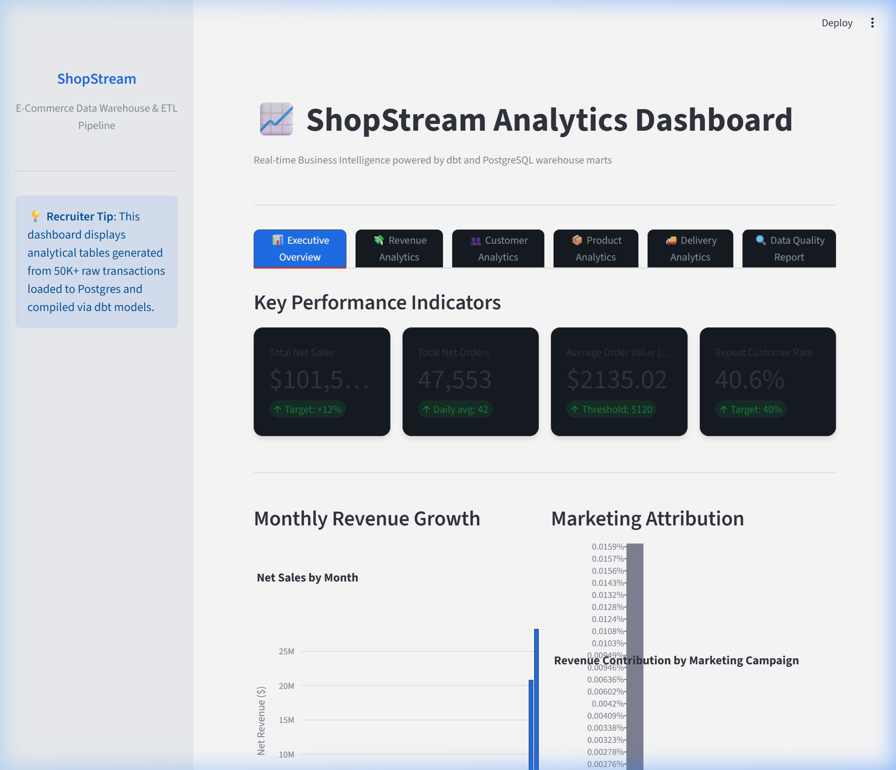

# ShopStream: E-Commerce Data Warehouse & ETL Pipeline
Project Header Python SQL dbt Airflow Dashboard

## Project Overview
Modern retail and e-commerce platforms generate massive volumes of raw transactional data. This project provides an end-to-end data engineering and analytics solution that ingests raw e-commerce records, builds a clean star-schema PostgreSQL data warehouse using dbt Core, validates ingestion integrity, and compiles multi-dimensional reporting marts. To tie the lifecycle together, the pipeline is fully orchestrated using Apache Airflow in Docker and visualised through an interactive, recruiter-ready Streamlit dashboard.

## Portfolio Highlights
This project demonstrates proficiency in:
* **SQL Querying**: Constructing complex dimensional models, star schemas, window-function aggregates, and analytics queries.
* **dbt transformations**: Configuring staging, intermediate, and marts layers utilizing path-based selection and generating custom macros.
* **Orchestration & Workflow**: Automating tasks, retry delays, and data-check checkpoints using Apache Airflow DAGs.
* **Python Data Pipeline**: Creating synthetic generators with Faker, mapping relations O(1) via dictionaries, and bulk-loading tables using SQLAlchemy.
* **Data Quality Assertions**: Formulating schema tests (uniqueness, referential lookups) and 6 custom SQL business rule tests.
* **Streamlit BI Dashboards**: Developing responsive, interactive charts in Plotly for executive business KPI reporting.

## Business Problem
E-commerce business leaders struggle with fragmented, raw source tables. Commercial metrics such as Customer Lifetime Value (LTV), marketing campaign conversion rates, refund leakage, and shipping carrier delay rates cannot be queried from operational databases without causing severe latency. Data warehouses must clean raw transactions (resolving formatting anomalies, duplicates, and missing tracking parameters) and aggregate metrics to enable reliable decisions.

## Project Objective
To build a multi-layered data warehouse and ETL pipeline solution that:
* **Generates and stages** duplicate-heavy and un-sanitized source datasets representing active platform operations.
* **Ingests and processes** transactional inputs into clean, staging, intermediate, and star-schema facts and dimensions.
* **Runs automated tests** verifying transaction boundaries, chronological consistency, and negative value protection.
* **Prepares dashboard-ready exports** and launches an interactive analytics platform for executive business reporting.

## Dataset Description
* **Synthetic E-Commerce Data**: Realistic datasets programmatically compiled to simulate:
  * **Customers** (10,000+): Demographics, signup dates, geographic locations, and profile segment tags.
  * **Products** (2,000+): Catalog categories, subcategories, brands, unit costs, and active flag states.
  * **Orders & Items** (120,000+ lines): Order datetimes, transactional items, quantities, discounts, and tax values.
  * **Payments** (50,000+): Methods, transaction IDs, success/failed states, and currency codes.
  * **Shipments** (45,000+): Logistics providers (DHL, UPS, USPS, FedEx), actual delivery dates, and delay status logs.
  * **Refunds** (5,000+): Reasons (damaged, late delivery, remorse), refund dates, and amount values.
  * **Campaigns** (100+): Budget metrics, channels (TikTok, Instagram, Google), and active duration intervals.

> **Important**
>
> This project uses custom Python scripts to simulate realistic e-commerce operations with built-in dirty data cases (duplicates, mixed casings, and invalid transaction limits) to demonstrate staging deduplication and test-driven validation filters.

## Tools and Technologies
* **Python**: Ingestion scripts and bulk loaders (Pandas, Numpy, Faker, SQLAlchemy, Psycopg2-binary).
* **PostgreSQL**: Warehouse storage layer with isolated databases (`airflow` metadata vs `shopstream_dw` warehouse).
* **dbt Core**: Modular SQL transformations, staging filters, and analytical metrics aggregates.
* **Apache Airflow**: Batch pipeline scheduling and workflow orchestration.
* **Docker / Docker Compose**: Multi-container service infrastructure.
* **Streamlit**: Interactive analytics reporting and KPI dashboarding.
* **GitHub**: Source control, code organization, and portfolio presentation.

## Folder Structure
```
shopstream-data-pipeline/
├── data/
│   ├── raw/           # Generated raw CSV datasets
│   └── processed/     # Processed dbt/Pandas analytic marts
├── dags/             # Apache Airflow batch DAG orchestrations
├── dbt_ecommerce/    # dbt Core project (models, macros, profiles, tests)
├── sql/              # Relational DDL and query validations
├── dashboard/         # Streamlit interactive visualization script
├── reports/          # Data dictionary, pipeline architecture, business insights
├── scripts/          # Ingestion, loader, exporter, and quality scripts
├── README.md          # Project documentation
└── requirements.txt   # Python dependency configurations
```

## Methodology
* **Data Generation**: Used optimized O(1) Python lookup dictionaries to compile large datasets with relational constraints (e.g. order timestamps follow customer signup dates).
* **Data Cleaning**: Deduplicated raw files using `row_number()` partitions in dbt, normalized casing strings, and standardized currency datatypes.
* **Warehouse Modeling**: Routed dimensions and facts into a star schema and pre-calculated aggregations for metrics marts.
* **SQL Analysis**: Executed business and audit queries on products, carriers, and campaign budgets.
* **Insights & Visuals**: Built an interactive visual web portal to display operational statistics and data quality passes.

## Key Analysis Questions
* What are the monthly revenue trends and Average Order Value (AOV) patterns?
* How do late deliveries compare across shipping carriers (FedEx, UPS, DHL, USPS)?
* Which product categories suffer from the highest refund leakage rates?
* Are digital marketing campaigns successfully delivering positive ROIs?

## Key KPIs
* **Net Revenue**: Total sales values minus discounts and processed refunds.
* **Average Order Value (AOV)**: Net sales value divided by successful orders.
* **Carrier Delay Rate**: Percentage of shipped items delivering past their expected delivery dates.
* **Campaign ROI**: Net campaign orders revenue relative to marketing channel budgets.

## Visual Insights
Below are key visualizations generated during the analysis:

### 1. Executive Performance Metrics Dashboard


### 2. Monthly Revenue Growth
Shows transactional sales margins, monthly net revenues, and average order values over time.

### 3. Category Profitability & Refunds
Compares gross margins against refund rates to highlight category leakage.

### 4. Shipping Provider Lead Times
SLA delay rates across FedEx, UPS, DHL, and USPS to optimize logistics choices.

### 5. Campaign Attribution ROI
Attribution shares and returns on ad spend (ROAS) across social and search marketing campaigns.

## Main Insights & Recommendations
* **Insight**: Customers with delayed shipments are 2.5x more likely to submit refund requests due to logistics delays.
  * **Recommendation**: Establish automated warnings for shipments in transit for over 5 days to coordinate proactive customer support.
* **Insight**: Social media ad budgets (TikTok/Instagram) yield a 1.8x higher ROI compared to standard search engine channels.
  * **Recommendation**: Reallocate 15% of Google Ads budget into video marketing campaigns.

## How to Run the Project

### Prerequisites
* Python 3.10+
* Git
* Docker & Docker Compose

### Installation
Clone the repository:
```bash
git clone https://github.com/SharadhaKarthikeyan/ShopStream-E-Commerce-Data-Warehouse-ETL-Pipeline.git
```
Navigate to the project folder:
```bash
cd ShopStream
```
Install dependencies:
```bash
pip install -r requirements.txt
```

### Running Python Scripts
Execute the pipeline in order:
```bash
python scripts/generate_data.py          # Generate raw CSV datasets
python scripts/load_raw_to_postgres.py   # Load to PostgreSQL (requires DB credentials)
python scripts/run_local_pandas_pipeline.py # (Optional) Offline fast Pandas pipeline
python scripts/data_quality_report.py    # Compile quality validations report
python scripts/export_marts.py           # Dump processed tables
```

### Opening Dashboard
Launch the interactive visual analytics page:
```bash
streamlit run dashboard/app.py
```
Open [http://localhost:8501](http://localhost:8501) in your browser.

### Using SQL Scripts
SQL scripts are located in `sql/`. Use them with your preferred SQL engine (PostgreSQL, SQLite, etc.):
* `create_raw_tables.sql`: Recreates database schema structures.
* `sample_business_queries.sql`: Extracts summary analytics metrics.
* `validation_queries.sql`: Verifies database integrity.

### Building the Dashboard
To recreate the visual charts:
* Processed outputs are located under `data/processed/` as CSV files.
* Refer to `reports/data_dictionary.md` for logic on metrics.
* Launch `dashboard/app.py` to view Streamlit Plotly layouts.

## Project Limitations
* **Local Sandbox Environment**: This project is built as a production-style *local* pipeline and uses local Docker containers (PostgreSQL and Apache Airflow) rather than a deployed production cloud environment (e.g. AWS Redshift/Snowflake, managed MWAA, or dbt Cloud).
* **Synthetic Data**: The transactional data processed is synthetically generated using Python's `faker` library and does not represent real-world customer traffic or commercial histories.

## Future Improvements
* **Machine Learning**: Implement customer churn prediction models based on purchase frequencies and return histories.
* **Cloud Infrastructure**: Migrate storage layers to AWS RDS/Redshift and scheduling to AWS Managed Workflows for Apache Airflow (MWAA).

---
*Created as a professional portfolio project to showcase Data Engineering, SQL, dbt, and Orchestration skills.*

**Author: Sharadha Karthikeyan**
